<div align="center">

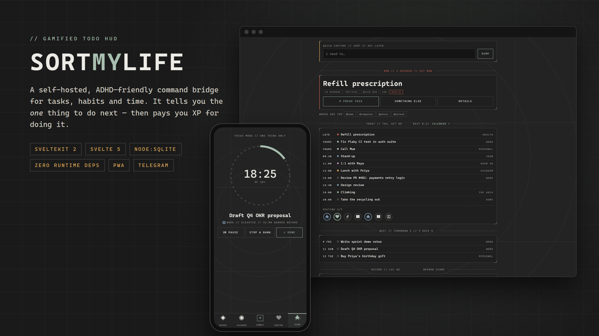

# SortMyLife

**A self-hosted, gamified command bridge for tasks, habits and time.**<br>
It answers *"what should I do right now?"*, then pays you XP for doing it.


</div>

---

## Why it exists

Most todo apps are good at storing tasks and bad at the hard part, which is **starting one**.
SortMyLife was built for an ADHD brain. When you open it, you see one task, the reason it was
picked, and a button to start it. Everything else waits until you ask for it.

It looks like a clockwork instrument panel (charcoal, sage, brass and rust, with pixel-art
sprites drawn in code) and runs as a single Node process on a home PC, reached from anywhere
over Tailscale.

<div align="center">
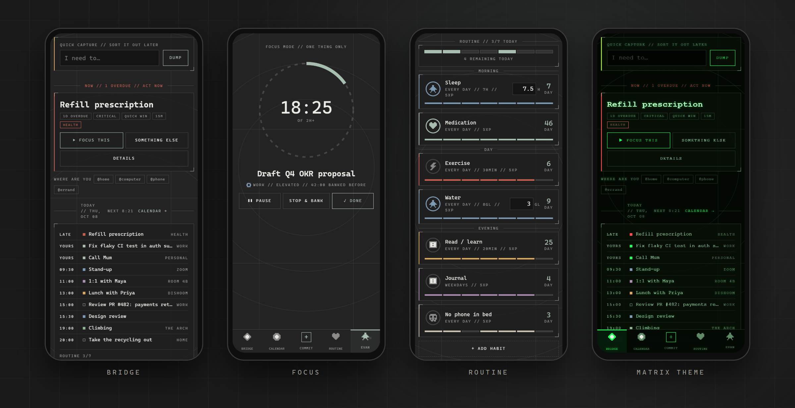
</div>

---

## Key strengths

### 🎯 It decides what you do next
- **NEXT UP scoring.** Each open task gets a score from urgency, priority, effort and how long
  you've been avoiding it. You see the top one, along with the reasons for it (`1D OVERDUE`,
  `CRITICAL`, `QUICK WIN`).
- **One thing at a time.** You get `FOCUS THIS`, `SOMETHING ELSE` and `DETAILS`. Skipping a
  task doesn't delete it or reshuffle the list.
- **Context filter.** Tag tasks `@home`, `@computer`, `@phone`, `@errand` or `@outside` and the
  pick changes to match where you are.

### 🧠 Built around how ADHD actually goes
- **Capture first, sort later.** Type a title and press Enter, and the task goes to the Inbox.
  The box clears before the request finishes.
- **Avoidance clock.** A task that hasn't been touched in 7+ days gets flagged as `AVOIDING`,
  and its score goes up.
- **Commit to today (★).** Promising a task for today gives it +45. The promise is stored as
  a day key, so it expires at midnight with no cleanup job.
- **Waiting-on.** A task that's blocked on someone else leaves the ranking until it's unblocked.
- **Focus mode.** You get a timer ring, pause, *stop & bank* (time is added to the task) and
  done. A screen wake lock keeps the phone awake while the timer runs.

### 🎮 A game that can't be farmed
- **XP and levels.** Task XP depends on priority, and finishing before the deadline pays 1.5×.
  Habits and initiatives earn XP too.
- **Daily quota streak.** Finish *N* tasks a day to keep the streak going. It's computed on
  read, so no cron job is needed to break it.
- **Anti-farming by design.** Undo refunds XP. Each initiative stage pays only once, because
  its timestamp doubles as the receipt. Deleting an initiative refunds everything it paid.

### 🗓️ Everything else in one place
| | |
|---|---|
| **Calendar** | Day, week and month views. Overlapping events get packed side by side, and task deadlines appear on the grid. **Available time** finds free gaps in your day and lists the tasks whose effort estimate fits each one. |
| **Routine** | Morning, day and evening habits with weekday masks, per-habit streaks, optional targets (`7h`, `8 glasses`) and a 7-day heatmap. |
| **Telegram** | Reminders fire *at* a time, or *unless done* (they stay quiet if you already did the thing). Messaging the bot captures to your Inbox, and `/idea …` creates an initiative. |
| **Initiatives** | Self-started work moves through `idea → pitched → doing → shipped → impact`. **Copy for review** turns it into plain text you can paste into a performance review. |
| **Multi-user** | scrypt passwords, DB-backed sessions, per-username login throttling and an admin panel. Every query is scoped to the user who made it. |

### 🎨 Nine themes, drawn in code
Each palette is one block of eight hex values in `app.css`. Every other colour is
`color-mix`ed from them, so adding a theme means writing hex values and nothing else. The
sprites are 8×8 character grids rendered as SVG rects, so they stay sharp at any size and can
be recoloured freely.

<div align="center">
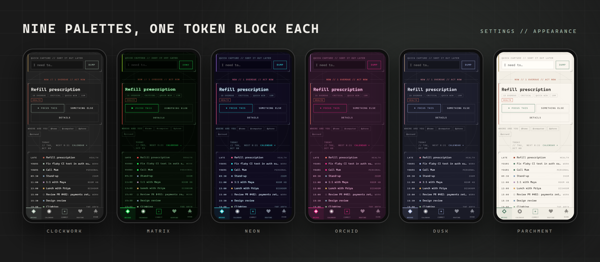
</div>

### ⚙️ Engineering that stays small
- **Zero runtime dependencies.** The database is Node 24's built-in `node:sqlite`. There's no
  ORM and no driver. The only dependencies are SvelteKit, Svelte, Vite and the Node adapter, all
  at build time.
- **One mutation path.** Every write is `POST /api {op, ...}` routed through a single `OPS`
  table (49 ops). Validation, coercion and admin checks all live in that one file.
- **Pure game logic.** XP, levels, streaks, scoring, countdowns and timer math live in
  `game.js` with no I/O, and the same code runs on the server and in the browser.
- **The client derives its own state.** The Bridge loads every open task once and works out
  NOW, TODAY, NEXT and the counts in the browser, so it updates as the clock moves without
  polling.
- **Append-only migrations.** There are 8 schema versions, applied in a transaction on boot
  using `PRAGMA user_version`.
- About 7.5k lines across JS, Svelte and CSS. No TypeScript, no test framework.

---

## Screenshots

| Bridge (desktop) | Calendar: month |
|---|---|
| 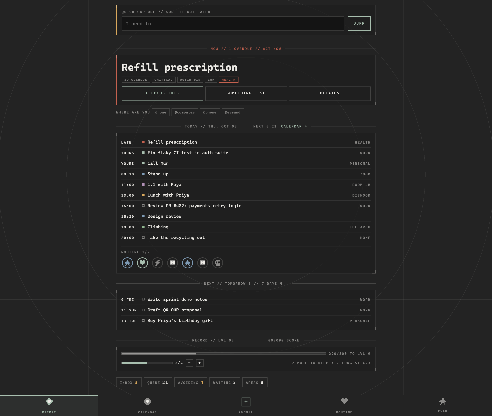 | 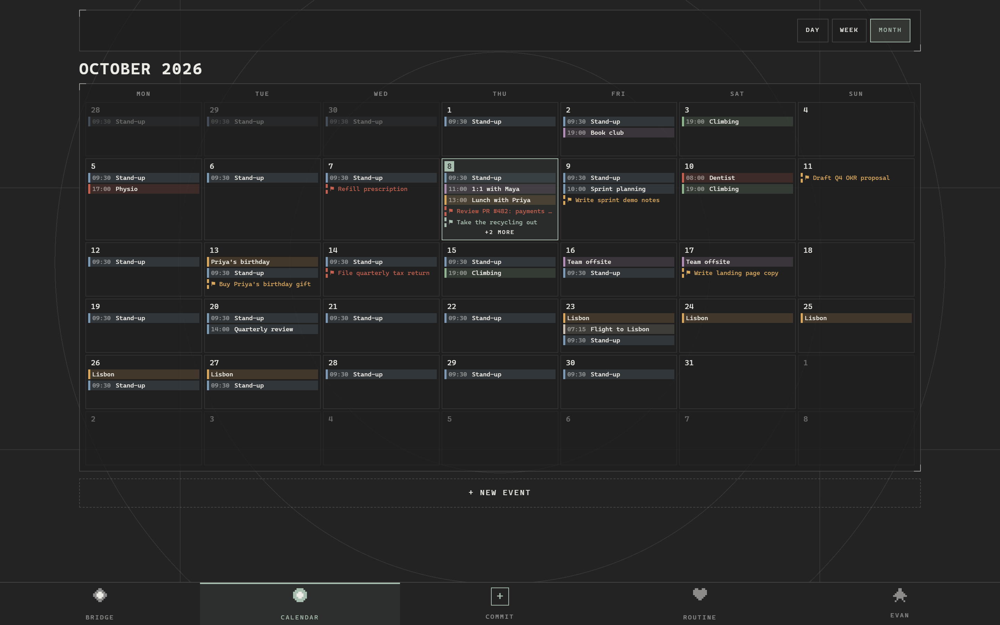 |
| **Areas + orbit** | **Initiatives** |
| 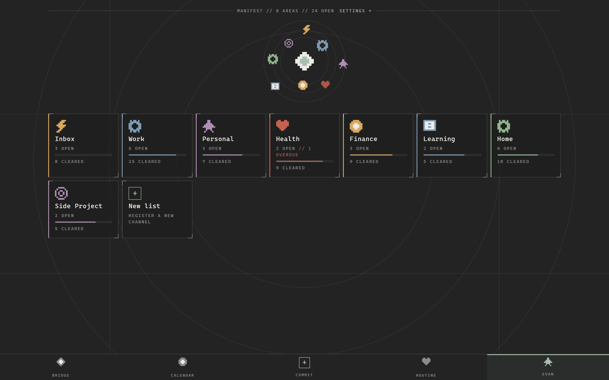 | 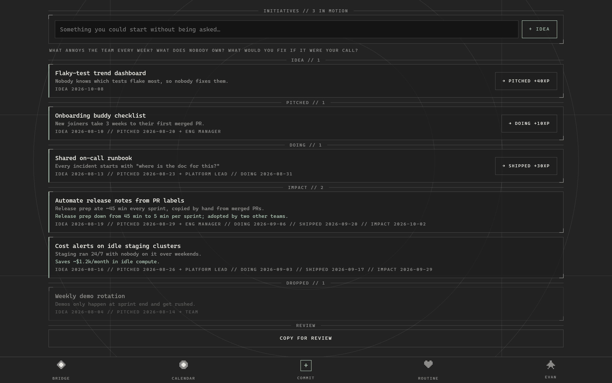 |
| **Focus (desktop)** | **Admin** |
| 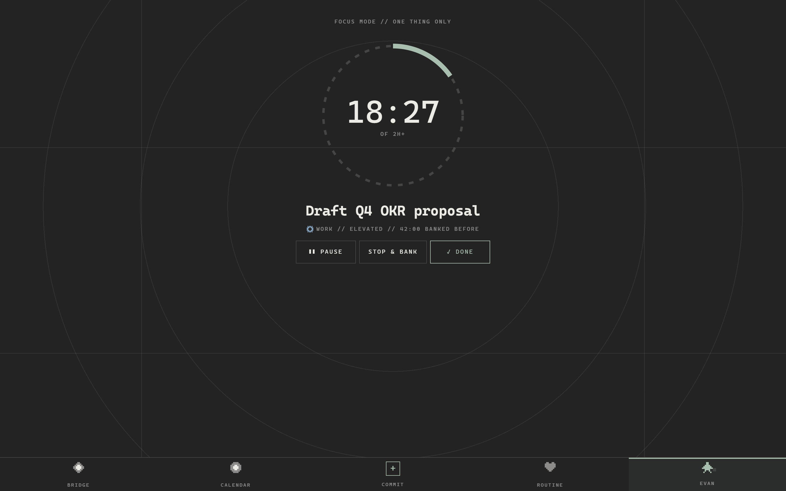 | 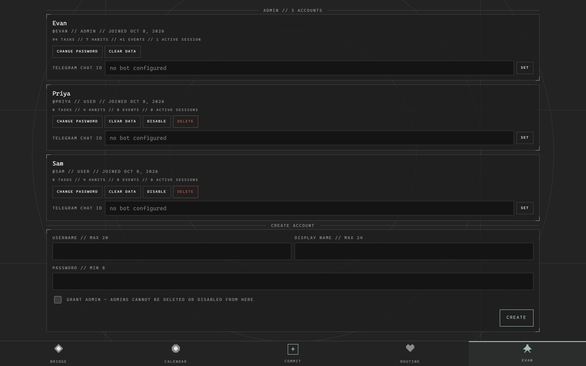 |

<details>
<summary>More: full-length mobile pages and settings</summary>

| Bridge | Routine | Focus |
|---|---|---|
| 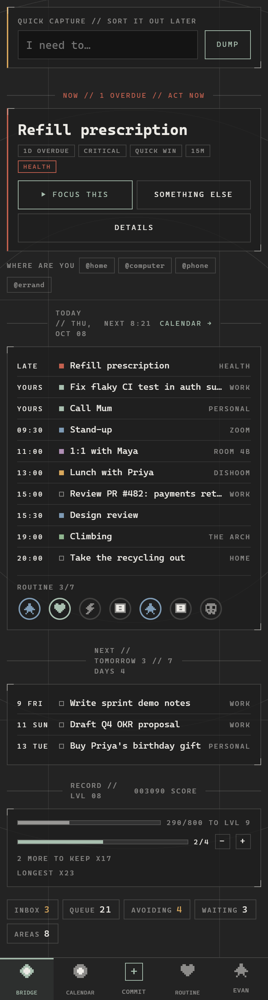 | 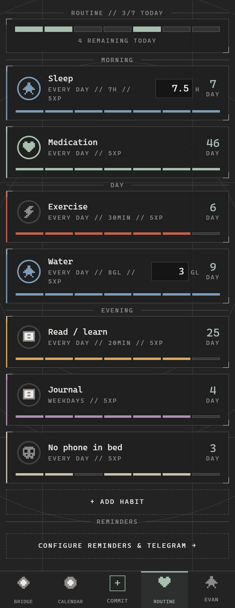 | 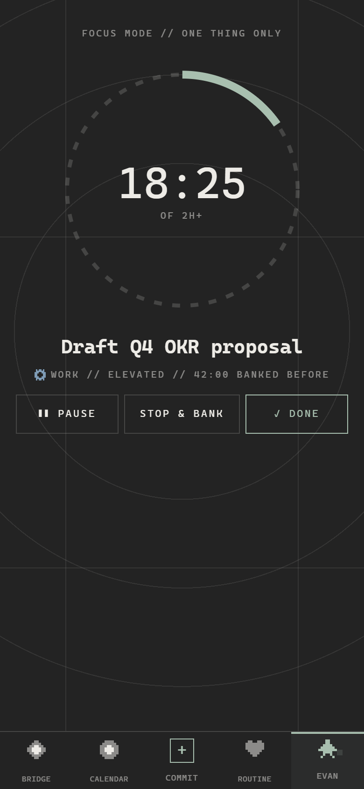 |

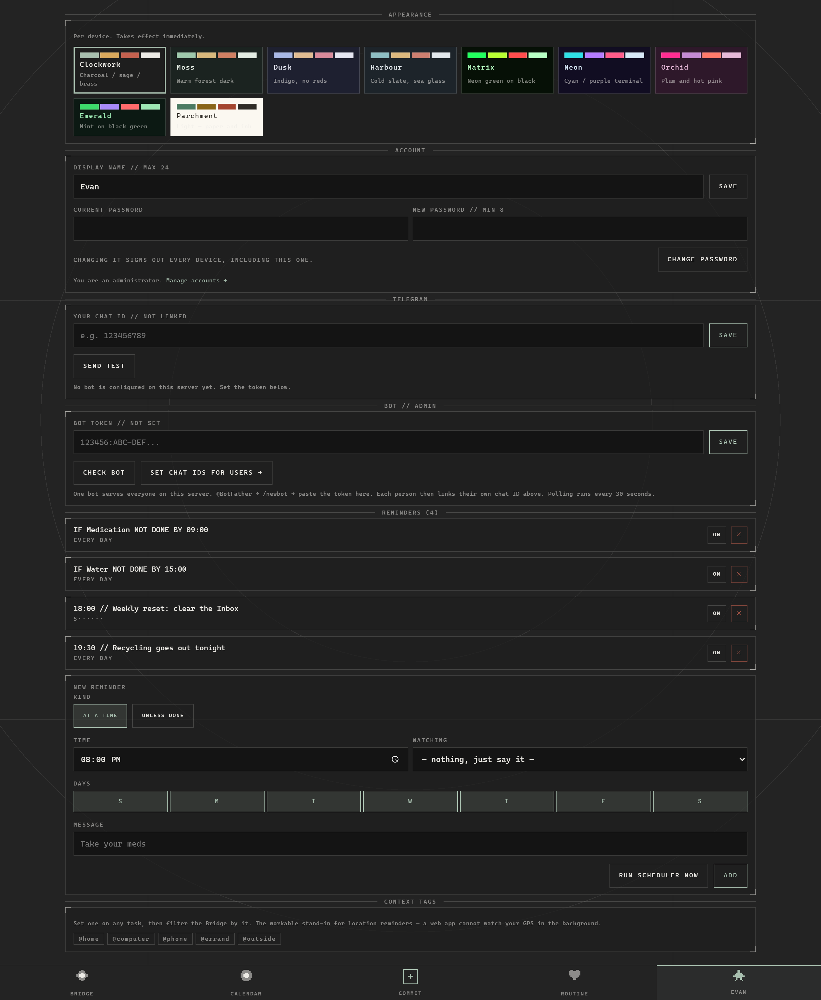

</details>

---

## How NEXT UP picks

`scoreTask()` in [`src/lib/game.js`](src/lib/game.js) adds these up:

| Signal | Points |
|---|---|
| Overdue | +100 |
| Due within 24h / 72h | +60 / +30 |
| Committed to today (★) | +45 |
| Untouched 7+ days | +20 |
| Effort ≤ 15 min / ≤ 30 min | +15 / +8 |
| Priority (routine / elevated / critical) | ×10 → +10 / +20 / +30 |
| Waiting on someone | excluded |

Ties go to the smaller effort, because starting is the hard part.

---

## Architecture

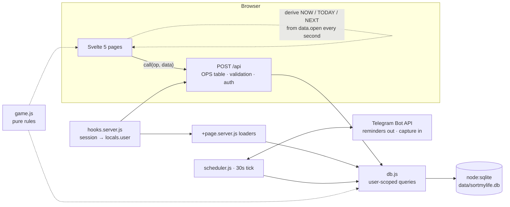

| Path | Role |
|---|---|
| `src/lib/game.js` | All game math: XP, levels, streaks, scoring, avoidance, focus timer |
| `src/lib/server/db.js` | Schema, migrations and every query. Each one takes the user id first |
| `src/routes/api/+server.js` | The only mutation endpoint |
| `src/lib/server/scheduler.js` | The only background timer: reminders and Telegram polling |
| `src/lib/calendar.js` | Pure calendar math: grids, overlap packing, free gaps |
| `src/lib/sprites.js` | The pixel art, as 8×8 character grids |

---

## Getting started

Requires **Node 24+**, for the built-in `node:sqlite`.

```bash
npm install
npm run dev        # http://localhost:5173 (also exposed on LAN / Tailscale)
```

Production:

```bash
npm run build
npm start          # node build/index.js on PORT (default 3000)
```

On Windows, `start.cmd` builds and starts in one step.

On first load you'll be sent to **`/setup`** to claim the admin account.

| Env var | Default | What it does |
|---|---|---|
| `PORT` | `3000` | HTTP port |
| `SML_DB` | `data/sortmylife.db` | SQLite file. Delete it to reset everything |
| `SML_TG_TOKEN` | — | Telegram bot token (overrides the one set in the UI) |
| `SML_TG_CHAT` | — | Telegram chat ID override |

**Telegram:** create a bot with @BotFather, then paste the token in *Settings → Bot*
(admin only). Each user messages the bot, which replies with their chat ID, and they paste that
ID into their own settings.

---

## Security model

- Built for a **private network**. Tailscale is the perimeter, and signup is open to anyone who
  can reach the server.
- Passwords are hashed with `scrypt` (`node:crypto`). Session cookies are `httpOnly` and
  `sameSite=lax`, and `secure` when served over HTTPS.
- Login failures are throttled per username. Unknown users and wrong passwords get the same
  error message.
- Every query filters on `user_id`, and the user id comes from the session, never from the
  request body.
- The Telegram bot token is admin-only and never sent to the client.

---

## Deliberately not built

- **External calendar sync** (ICS, Google). The calendar is self-contained by choice.
- **Location reminders.** A web app can't track GPS in the background, so context tags are the
  substitute.
- **Timezones.** Times use the server's local time, since this is one machine with one clock.

The full design log is in [`docs/CHECKPOINTS.md`](docs/CHECKPOINTS.md).

---

## License

[MIT](LICENSE) © 2026 Md. Nurusshafi Evan
